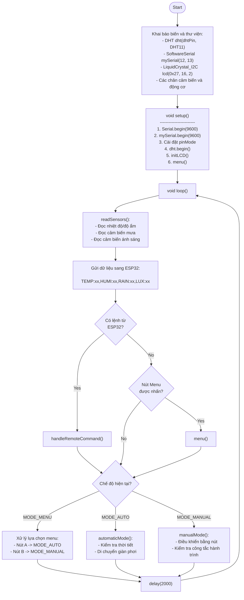
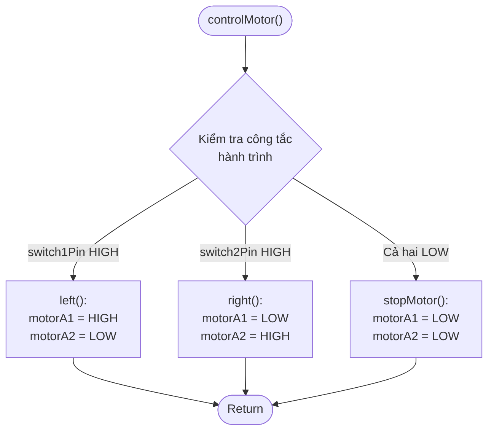
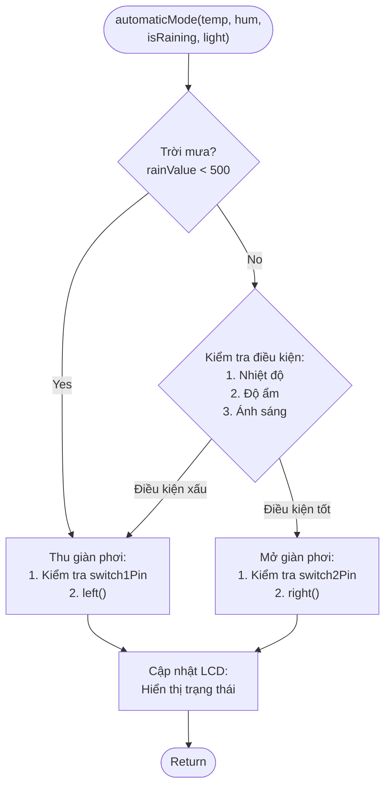
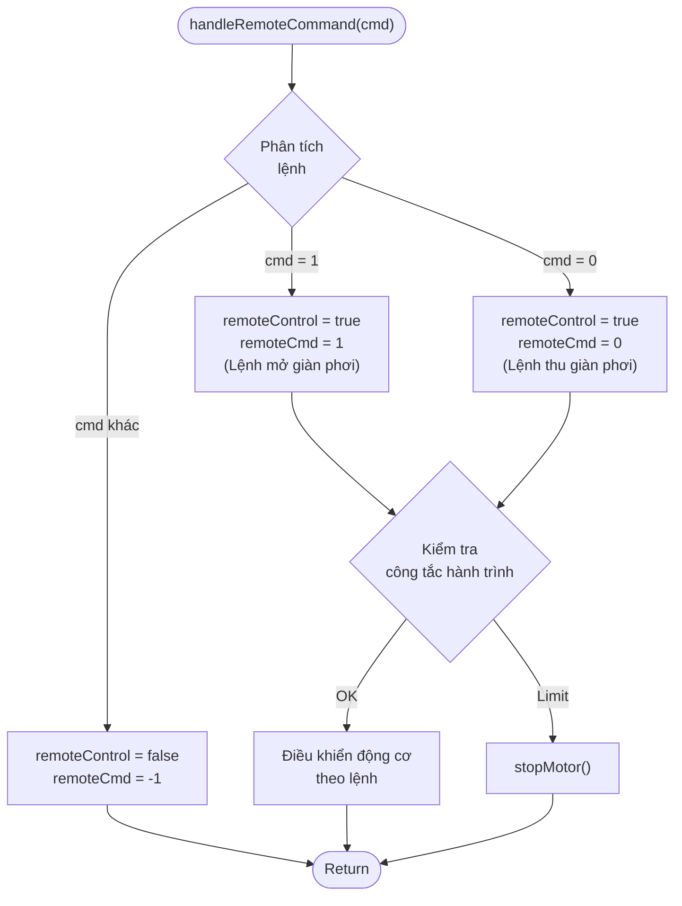
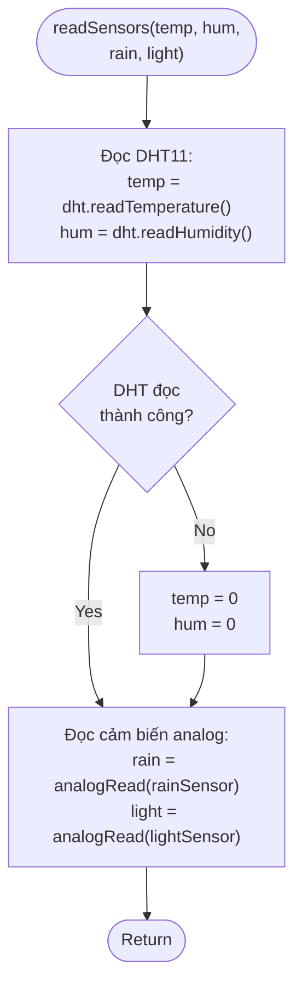

# Smart Clothes Drying Rack - System Flowcharts

## 1. Main Program (Arduino Controller)

## 2. Motor Control Function

## 3. Automatic Mode Function

## 4. Remote Control Handler

## 5. Sensor Reading Function

